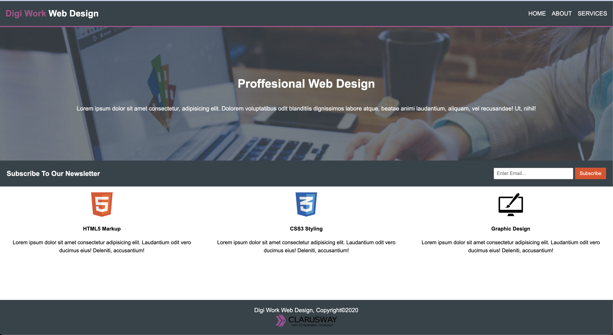
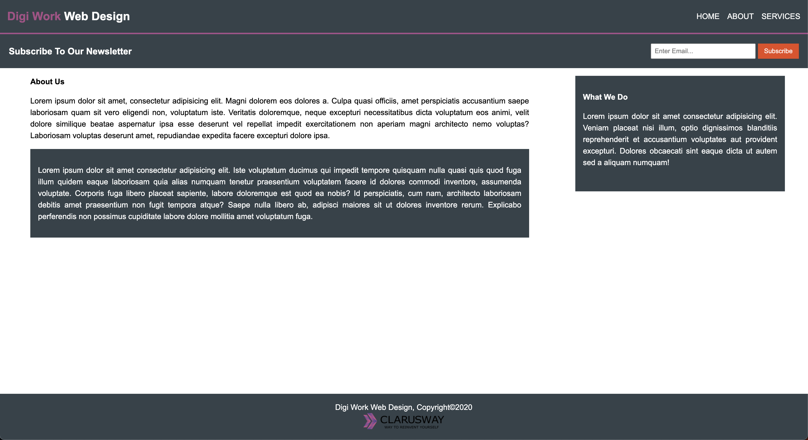
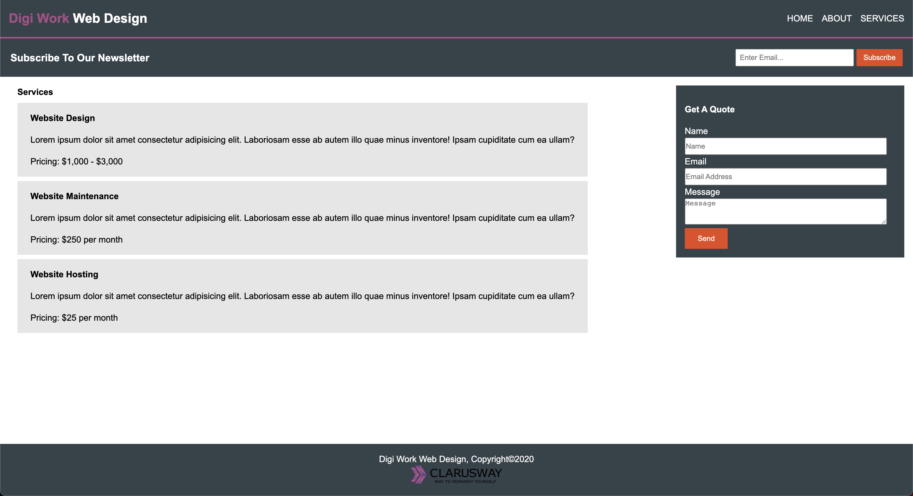

# Project : Website Page Design

## Description

Project aims to create a website page with router.

## Project Skeleton

```
website-page-design (folder)
|
|----readme.md
|----index.html
|----style.css
|----about.html
|----services.html
|----images (folder)
```

## Objective

Build a Landing same as in the example images.

### At the end of the project, following topics are to be covered;

- HTML

- CSS

### At the end of the project, i will be able to;

- improve coding skills within HTML & CSS

- use git commands (push, pull, commit, add etc.) and Github as Version Control System.
